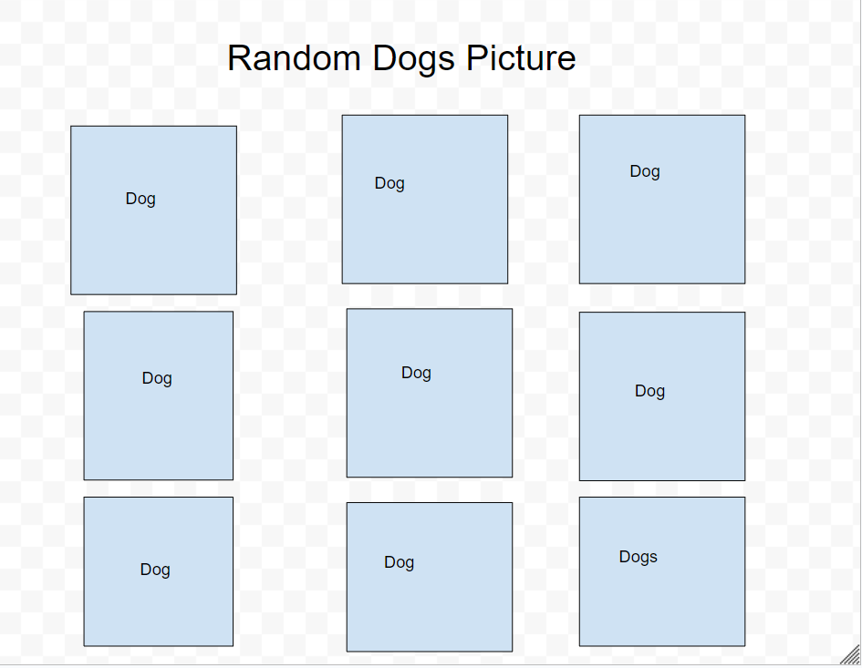

## Fox Dog Images
- This is a single page application which allow user to see the different dog and fox images by logging in app.

## Link 
 
 - [Link to Website](https://fox-dog-images.netlify.app/)

## Screenshots 
 - 
 - 
 - 
 

## How to use the app ?

- Click on the link above to open app in browser
- Login with your google account to access the feature of the app
- Click on Fox images to see picture of a Fox
- Click on Dog images to see the pictures of a Dogs
- Click on next button to view the next image.
- Clicking on homepage will take you to the Login page
- Click logout to exit and return to Login Homepage

 ## Techolongies Used

- React
- Tailwind CSS
- 0Auth
- APIs
- Netlify 

## Icebox Features

 - Add Dogs detail page to learn more information about dogs
 - Add Foxs detail page to learn more information about Foxes
 - Add option to save favorite Images
 - Cloudinary Support
 - Adding more animals to the website

